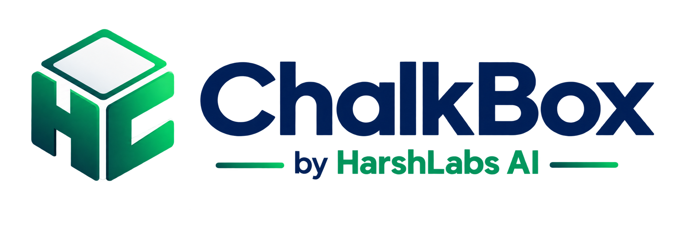
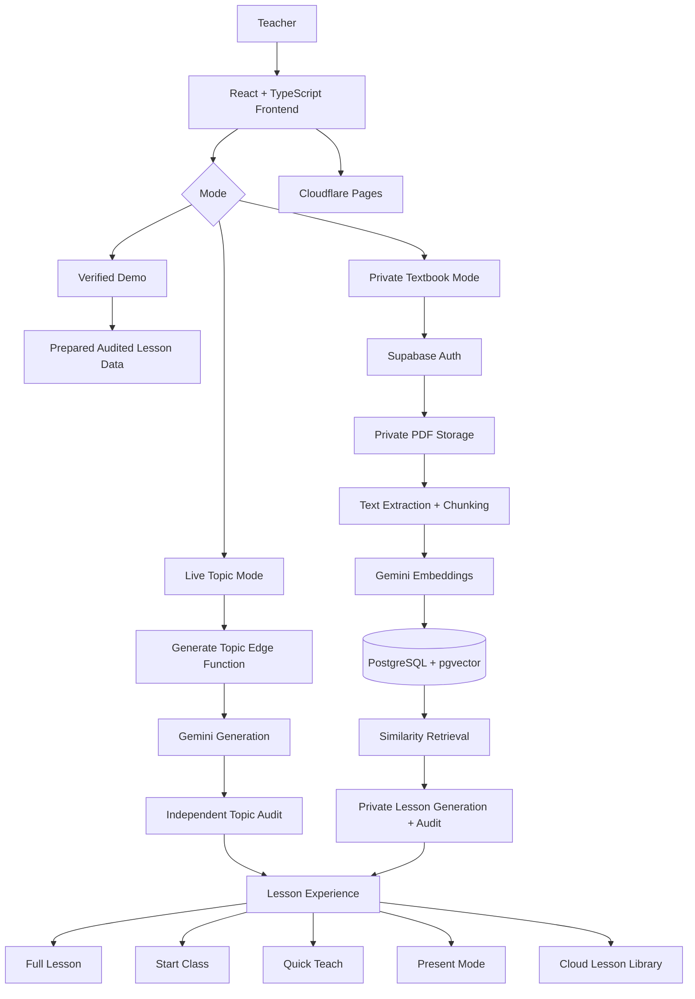

<p align="center">
  
</p>

<h1 align="center">ChalkBox — AI Lesson Planning for Real Classrooms</h1>

<p align="center">
  <strong>Your classroom. Your plan. Powered by HarshLabs AI.</strong>
</p>

<p align="center">
  A teacher-first AI lesson-planning platform for Class 8–10 Science that turns textbook material and teaching topics into structured, classroom-ready lesson plans.
</p>

<p align="center">
  <a href="https://chalkbox-harshlabs.pages.dev"><strong>🚀 Live Application</strong></a>
  ·
  <a href="https://github.com/harshawardhanchitnis/Omnikon_Hackathon_Harshawardhan_Chitnis"><strong>💻 GitHub Repository</strong></a>
</p>

---

## 🏆 Omnikon National Hackathon 2026

**ChalkBox** was built for the **Omnikon National Hackathon 2026 – Final Round** by **Team HarshLabs**.

The project focuses on a practical classroom problem: teachers often have the curriculum and the textbook, but still need significant time to convert that material into a clear teaching flow, activities, examples, board work and assessment — especially when classroom resources are limited.

ChalkBox is designed to reduce that planning burden while keeping the **teacher in control**.

---

## Project Overview

ChalkBox is an **AI-powered lesson planning and classroom delivery platform** built specifically around the workflow of a school teacher.

A teacher can start in two ways:

1. **Textbook Mode** — generate or open lessons grounded in textbook material.
2. **Topic Mode** — describe what needs to be taught and let ChalkBox build either a complete lesson or focused teaching help.

The platform does not stop at generating a block of text. A lesson is transformed into multiple teacher-facing experiences such as:

- **Full Lesson** for complete planning and reference
- **Start Class** for step-by-step classroom delivery
- **Quick Teach** for a shorter teaching version
- **Present Mode** for projector/classroom presentation
- **Hindi classroom translation** for supported lesson content
- **Teacher notes, saved plans and cloud library** for authenticated users

The current product scope is intentionally focused on **Class 8–10 Science**.

---

## Motivation

Teachers frequently work under constraints that generic AI tools do not account for:

- limited preparation time
- limited laboratory equipment
- inconsistent access to projectors or internet
- the need to explain concepts at the correct class level
- the need for safe, realistic classroom activities
- the need to stay grounded in the material actually being taught
- the need to convert content into a usable sequence rather than a long answer

ChalkBox was created around a simple idea:

> **AI should help a teacher teach — not give the teacher more content to read.**

The system therefore prioritizes classroom flow, teacher scripts, board work, examples, activities, assessment, resource adaptation, safety and source grounding.

---

## Core Product Modes

### 1. Verified Demo

The public demo can be explored **without registration**.

It includes six prepared Science lesson experiences across Classes 8, 9 and 10 so that judges, teachers and visitors can immediately explore the complete ChalkBox teaching workflow without depending on a live AI call.

Prepared demo lessons include topics such as:

- Chemical Effects of Electric Current
- Materials: Metals and Non-Metals
- Force and Laws of Motion
- Work and Energy
- Life Processes
- Electricity

Demo content remains separate from authenticated teacher data.

### 2. Live Topic Mode

Teachers can enter an unseen Science topic or a specific teaching request and configure:

- class level
- lesson duration
- resource level
- classroom context
- language
- teaching mode

Two generation paths are available:

**Complete Lesson** — builds a full classroom plan.

**Focused Help** — creates targeted support when a teacher needs help explaining one difficult concept rather than generating an entire lesson.

Generated Topic lessons pass through an additional science/classroom audit stage before being presented to the teacher.

### 3. Private Textbook Mode

Authenticated teachers can upload their **own Science PDF textbook** and generate lessons from that private source.

The private textbook pipeline:

1. uploads the PDF to private Supabase Storage
2. extracts readable page content
3. divides the material into source chunks
4. creates 768-dimensional embeddings
5. stores vectors in PostgreSQL using `pgvector`
6. retrieves relevant chunks using cosine similarity
7. generates a source-grounded lesson
8. validates science, classroom feasibility, safety and source faithfulness
9. saves the approved lesson to the teacher's cloud library

Generated sections retain **source-page provenance**, allowing the teacher to see which textbook pages support the lesson content.

---

## Classroom Lesson Structure

A complete ChalkBox lesson is organized around an explicit teaching sequence rather than a single AI response:

```text
Hook
  ↓
Define
  ↓
Explain
  ↓
Visualize
  ↓
Example
  ↓
Activity
  ↓
Practice
  ↓
Check Understanding
```

The complete planning view also includes supporting material such as:

- Board Plan
- How to Teach guidance
- Lesson Materials
- teacher cues
- expected student responses
- formulas where applicable
- safety notes
- source-page references for textbook-grounded lessons

---

## Key Features

### Teacher-first lesson planning
- Converts a topic or textbook source into a usable classroom sequence.
- Provides teacher scripts, prompts, expected responses, examples and assessment.
- Keeps the lesson duration visible throughout the teaching flow.

### Low-resource and well-equipped classroom adaptation
ChalkBox supports two explicit classroom resource modes:

- **Low-resource** — prioritizes chalkboard work, paper, pencils and commonly available classroom objects.
- **Well-equipped** — can make use of additional classroom/laboratory resources where appropriate.

### Source-grounded private RAG
- Teacher-owned PDFs are processed privately.
- Similarity retrieval is performed only against the selected teacher-owned document.
- Generated Activity and lesson sections retain supporting source pages.

### Complete + Focused Topic generation
Teachers can choose between generating an entire lesson and asking for focused help on one concept.

### Hindi classroom support
Lesson content can be rendered in Hindi through a server-side translation workflow with cleanup/quality safeguards for classroom terminology.

### Present Mode
Generated lessons can be converted into classroom presentation slides with:

- canonical lesson-step numbering
- continuation pages for dense content
- lesson timer controls
- fullscreen support
- Hindi presentation support

### Quick Teach
A compact version of the lesson is available for situations where the teacher needs the essential teaching path quickly while retaining relevant safety guidance.

### Cloud teacher workspace
Authenticated teachers receive:

- My Textbooks
- Cloud Lesson Library
- saved Topic plans
- private textbook lessons
- teacher notes/customizations
- persistent account-linked lesson history

### Safety-aware generation
ChalkBox includes both deterministic and AI-based safety controls for classroom activities.

Examples of guarded scenarios include:

- strong acids and unsafe home experiments
- open flames
- focusing direct sunlight on combustible material
- release of hard projectiles
- unsafe student use of blades/knives
- hydrogen generation near ignition sources
- unsafe handling of reactive or heated glassware

The goal is not only to reject unsafe instructions, but where possible to provide a **safer classroom alternative**.

---

## System Architecture



---

## Technology Stack

### Frontend
- **React 19**
- **TypeScript 6**
- **Vite 8**
- **React Router**
- **Tailwind CSS 4**
- **shadcn / Base UI components**
- **Lucide React**
- **Inter variable font**
- **unpdf / pdf-lib** for PDF workflows

### Backend & Data
- **Supabase Authentication**
- **Supabase PostgreSQL**
- **Supabase Storage**
- **Supabase Edge Functions / Deno**
- **PostgreSQL pgvector**
- **HNSW vector indexes**
- **Row Level Security (RLS)**

### AI
- **Google Gemini** generation models with fallback routing
- **Gemini embeddings**
- separate generation and auditing stages
- deterministic classroom-safety preflight rules

### Deployment
- **Cloudflare Pages** — frontend production hosting
- **Supabase** — authentication, database, private storage and serverless AI functions

---

## Privacy & Security Design

ChalkBox's authenticated product is designed around teacher-owned data.

### Owner-scoped data
Supabase RLS policies scope teacher plans, notes, customizations, textbooks, pages and chunks to the authenticated owner.

### Private textbook storage
Teacher PDFs are stored in a **private storage bucket**, with access restricted to the teacher's own user folder.

### Protected vector corpus
Raw textbook chunks and vectors are backend infrastructure rather than a public browser-readable dataset.

### Server-side AI credentials
Gemini API credentials and Supabase service-role credentials remain in server-side Edge Function environments and are not shipped to the browser.

### No student account requirement
The current lesson-planning workflow is teacher-first and does not require student accounts or student PII.

---

## Steps Undertaken

### 1. Teacher-first UI/UX
- Designed a classroom-focused landing experience.
- Built separate Demo and authenticated Product workspaces.
- Implemented responsive layouts for desktop, tablet and mobile.

### 2. Verified Textbook Demo
- Created six deterministic Science demo lesson experiences.
- Added source-page presentation and classroom-ready structure.
- Kept demo execution independent of live AI availability.

### 3. Live AI Topic Mode
- Added Complete and Focused generation modes.
- Added resource-level, duration, language and classroom-context controls.
- Separated generation from independent science/safety auditing.

### 4. Private Textbook RAG
- Implemented authenticated PDF upload.
- Added page extraction, chunking and embedding.
- Added pgvector cosine-similarity retrieval.
- Built private source-grounded lesson generation with provenance.

### 5. Classroom Delivery Experiences
- Full Lesson
- Start Class
- Quick Teach
- Present Mode
- teacher notes and saved-plan workflows

### 6. Safety & Reliability Hardening
- Added deterministic rejection of obvious hazardous prompts.
- Added classroom-safety transformations and audit rules.
- Added generation-model fallback handling.
- Added completeness validation for private textbook lessons before persistence.

### 7. Product Authentication & Persistence
- Teacher registration/sign-in
- session refresh and logout
- password recovery
- owner-scoped cloud library
- private textbook management

### 8. Production Deployment
- Frontend deployed through Cloudflare Pages.
- Backend Edge Functions deployed to Supabase.
- Final release tested across public, authenticated, private textbook, Hindi, responsive and safety flows.

---

## Getting Started Locally

### Prerequisites

- **Node.js 22.x**
- **pnpm 10.x**
- a Supabase project for authenticated/product functionality

### 1. Clone the repository

```bash
git clone https://github.com/harshawardhanchitnis/Omnikon_Hackathon_Harshawardhan_Chitnis.git
cd Omnikon_Hackathon_Harshawardhan_Chitnis
```

### 2. Install dependencies

```bash
pnpm install
```

### 3. Configure browser environment variables

Create `.env.local` from `.env.example` and provide the public Supabase configuration:

```env
VITE_SUPABASE_URL=https://your-project.supabase.co
VITE_SUPABASE_PUBLISHABLE_KEY=your-public-publishable-key
VITE_APP_URL=http://localhost:5173
```

> Never place `GEMINI_API_KEY`, Supabase service-role keys or other server secrets in frontend `.env` files.

### 4. Start the development server

```bash
pnpm dev
```

### 5. Production build

```bash
pnpm build
```

The production bundle is generated in:

```text
dist/
```

---

## Supabase Backend

Database migrations are located in:

```text
supabase/migrations/
```

Serverless functions are located in:

```text
supabase/functions/
```

Important Edge Functions include:

```text
generate-topic-lesson
audit-topic-lesson
ingest-private-textbook
generate-private-textbook-lesson
translate-lesson-text
```

Backend AI secrets must be configured only in the Supabase function environment.

---

## Project Structure

```text
Omnikon_Hackathon_Harshawardhan_Chitnis/
├── public/                  # Branding and illustration assets
├── src/
│   ├── components/          # Lesson, layout and product UI
│   ├── data/                # Prepared demo lesson/catalog data
│   ├── hooks/               # Product/session hooks
│   ├── lib/                 # Auth, lesson, RAG/API and presentation logic
│   └── pages/               # Public, demo and authenticated routes
├── supabase/
│   ├── functions/           # Edge Functions for AI/product workflows
│   └── migrations/          # PostgreSQL, pgvector, RLS and product schema
├── scripts/                 # Verification/build utilities
├── PRODUCT_RELEASE_TEST_PLAN.md
├── package.json
└── README.md
```

---

## Testing & Release Validation

The release workflow includes checks for:

- TypeScript compilation
- production Vite build
- secret scanning
- authentication and persistence
- Topic Complete and Focused flows
- private textbook upload/generation/provenance
- Hindi rendering
- low-resource and well-equipped lesson variants
- responsive UI
- classroom safety red-team prompts
- science-accuracy checks
- cloud lesson persistence and reopen flows

The repository also includes `PRODUCT_RELEASE_TEST_PLAN.md` for product-level verification.

---

## Key Insights

1. **Teacher workflow matters as much as model quality.** A scientifically correct response is not enough unless it can be used directly in class.
2. **RAG is valuable when provenance is visible.** Source-page grounding gives teachers a practical way to verify generated lesson material.
3. **Safety needs more than prompting.** Deterministic preflight rules, output transformations and a separate audit stage provide stronger protection than a single system prompt.
4. **Resource awareness changes lesson quality.** A useful activity for a well-equipped laboratory may be unusable in a low-resource classroom.
5. **Demo reliability matters.** Prepared verified lessons allow the core product experience to remain demonstrable even when external AI quotas or providers are unavailable.

---

## Challenges and Lessons Learned

- **Balancing AI flexibility with deterministic structure:** Generated lessons need creativity while still preserving a reliable classroom sequence.
- **Source faithfulness:** RAG generation must remain within retrieved textbook evidence and preserve useful page provenance.
- **Science precision:** Small wording errors can turn into classroom misconceptions, so independent auditing and targeted normalization are important.
- **Safety propagation:** Safety guidance must remain visible across every teaching surface, not only the original generated lesson object.
- **External AI reliability:** Model quotas, latency and provider failures require graceful fallback and fail-closed behavior.
- **Responsive classroom presentation:** Dense lesson content needs careful pagination to remain usable on real projector resolutions.

---

## Future Work

- Expand beyond Science to additional school subjects.
- Add broader curriculum/board adapters without coupling the core product to a single textbook provider.
- Improve large-document ingestion through resumable and batched indexing.
- Add richer teacher customization while preserving source provenance.
- Add lesson analytics and curriculum coverage views.
- Expand multilingual classroom support beyond Hindi.
- Add collaborative school/department workspaces.
- Continue improving adaptive projector pagination for highly visual lessons.

---

## Conclusion

ChalkBox demonstrates how Generative AI can be applied to education without reducing the teacher to a passive consumer of generated content.

The platform combines **lesson planning, RAG, source provenance, classroom safety, resource adaptation, multilingual support, authentication and cloud persistence** into one teacher-focused workflow.

Rather than asking *“What can AI generate for education?”*, ChalkBox is built around a more practical question:

> **“What does a teacher need in order to teach the next class well?”**

---

## Closing Remarks

This project brought together **frontend engineering, Generative AI, Retrieval-Augmented Generation, vector search, secure cloud architecture, product design, classroom safety and adversarial QA** in one end-to-end system.

🚀 **ChalkBox — Plan better lessons. Teach with confidence.**
