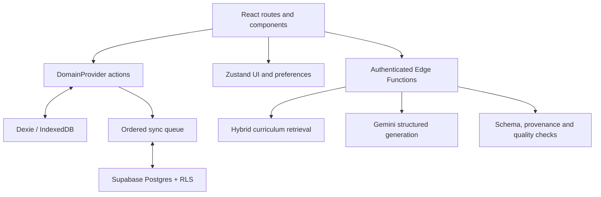

# ChalkBox

> Your classroom. Your plan. Powered by HarshLabs AI.

ChalkBox is a free-first, offline-ready lesson-planning and classroom-delivery workspace built for **Omni_EdTech_7 — Fast Lesson Planning Support for Teachers** at the Omnikon National Hackathon 2026.

It converts a short teacher brief into a structured, editable plan and supports the complete cycle: **Plan → Structure → Teach → Assess → Reflect → Reuse**. The deterministic prepared demo works immediately without an account, API key, database, or network after first load.

## Product highlights

- **Quick Brief:** type or dictate a natural-language classroom request, review extracted fields and assumptions, then generate.
- **Classroom profiles:** reusable, privacy-safe context for mixed grades, class size, language, connectivity, resources, and accessibility needs.
- **Curriculum-aware planning:** source-labelled board/grade/subject explorer and hybrid vector/keyword retrieval.
- **Teacher-controlled AI:** protected Gemini actions, strict schemas, visible provenance, deterministic quality checks, and honest prepared fallbacks.
- **Deep editing:** autosave, section regeneration, version checkpoints, restore, duplicate, preview, immutable share snapshots, print, and PDF.
- **Classroom Teaching Engine:** 17 typed instructional blocks, exact timing, progressive reveals, code-native visuals, misconception responses, multigrade attention scheduling, and no-device alternatives.
- **Classroom delivery:** private Teach Mode, broadcast-driven learner-only Present Mode, read-aloud, lesson/block timers, notes, and anonymous Quick Check 2.0 response guidance.
- **Assessment workflow:** provenance-labelled question bank, add-to-lesson, worksheet tray, learner PDF, and answer-key PDF.
- **Moderated community:** immutable approved lesson snapshots, private adaptation, submission status, reporting, and admin moderation.
- **Offline-first:** IndexedDB persistence, ordered sync queue, conflict choices, PWA caching, and one-click demo reset.
- **Secure capability sharing:** only a SHA-256 token hash is stored; anonymous visitors resolve a raw token through a narrow expiry/revocation RPC and cannot enumerate the share table.
- **Privacy by design:** no student accounts, names, individual marks, profiling, or named records.

## Run the complete demo

Requirements: Node.js 22+, Corepack/pnpm, and Git.

```bash
git clone https://github.com/harshawardhanchitnis/Omnikon_Hackathon_Harshawardhan_Chitnis.git
cd Omnikon_Hackathon_Harshawardhan_Chitnis
git switch build/chalkbox-complete
corepack enable
pnpm install --frozen-lockfile
pnpm dev
```

Open `http://localhost:5173`, select **Explore the prepared demo**, and follow the dashboard. No environment file is required for this path.

## Enable accounts, cloud sync, and live AI

Copy `.env.example` to `.env.local` and set only the public browser variables:

```dotenv
VITE_SUPABASE_URL=https://your-project.supabase.co
VITE_SUPABASE_PUBLISHABLE_KEY=sb_publishable_replace_me
VITE_APP_URL=http://localhost:5173
VITE_TURNSTILE_SITE_KEY=
```

`GEMINI_API_KEY` must never be placed in a `VITE_*` variable or browser code. It belongs in Supabase Edge Function secrets. Follow [the deployment guide](docs/DEPLOYMENT.md).

## Commands

| Command                    | Purpose                                                           |
| -------------------------- | ----------------------------------------------------------------- |
| `pnpm dev`                 | Start the Vite development server                                 |
| `pnpm build`               | Type-check and create the production PWA in `dist/`               |
| `pnpm preview`             | Serve the production build locally                                |
| `pnpm fixtures:validate`   | Validate canonical demo plans against shared contracts            |
| `pnpm curriculum:validate` | Verify source, attribution and chunk bounds for both bundles      |
| `pnpm curriculum:index`    | Index approved original/copyright-safe derived curriculum bundles |
| `pnpm typecheck`           | Run strict TypeScript project checks                              |
| `pnpm lint`                | Run ESLint with zero warnings                                     |
| `pnpm test`                | Run unit and component tests                                      |
| `pnpm test:e2e`            | Run desktop/mobile lifecycle and accessibility tests              |
| `pnpm screenshots`         | Capture the canonical judge evidence set                          |
| `pnpm verify`              | Run the complete non-browser production gate                      |

Install Playwright's free Chromium binary once before local E2E execution:

```bash
pnpm exec playwright install chromium
```

## Architecture at a glance



Domain records are stored in IndexedDB, not in Zustand/localStorage. Zustand retains only session mode, profile shell, preferences, and navigation state. Registered users optionally sync through owner-scoped repositories; demo records remain local and clearly labelled.

## Repository map

```text
src/                    React app, domain context, pages, components and services
packages/contracts/     Shared TypeScript/Zod domain and AI contracts
data/curriculum/        Original chunks and copyright-safe NCERT-derived summaries/locators
supabase/migrations/    Postgres, pgvector, RLS, moderation and retrieval SQL
supabase/functions/     Protected Gemini actions, RAG, indexing and health
tests/e2e/              Critical desktop/mobile and accessibility journeys
scripts/                Fixture, curriculum, smoke, screenshot and report tooling
docs/                   Scope, architecture, security, deployment and demo guide
report/                 Technical report source/evidence index
output/pdf/             Submission-ready technical report
public/                 PWA assets, free embedded fonts, headers and SPA routing
```

## Verification status

The checked-in quality gate validates fixtures, curriculum provenance, formatting, TypeScript, lint, 32 unit/component tests, production build, PWA output, and route smoke checks. GitHub Actions additionally installs Chromium and runs the desktop/mobile Playwright and axe suites. Exact hosted-service status is recorded in [INTEGRATION_STATUS.md](INTEGRATION_STATUS.md); no unverified integration is presented as live.

## Documentation

- [Project scope and build contract](docs/PROJECT_SCOPE.md)
- [System architecture](docs/ARCHITECTURE.md)
- [AI and retrieval pipeline](docs/AI_PIPELINE.md)
- [Classroom Teaching Engine](docs/CLASSROOM_ENGINE.md)
- [Security and privacy](docs/SECURITY.md)
- [Testing](docs/TESTING.md)
- [Deployment](docs/DEPLOYMENT.md)
- [Five-minute demo guide](docs/DEMO_GUIDE.md)
- [Integration status](INTEGRATION_STATUS.md)

## Team and originality

**Team HarshLabs** — Harshawardhan Chitnis (solo participant)  
Problem statement: **Omni_EdTech_7**  
Omnikon National Hackathon 2026

The competitor implementation was reviewed as an allowed benchmark. ChalkBox's source, styling, text, assets, data model, and architecture were independently built; no competitor source code or assets are copied.

## Licence

Source code is available under the [MIT License](LICENSE). Bundled Noto Sans fonts are licensed under the SIL Open Font License 1.1 in `public/fonts/NotoSansDevanagari-OFL-1.1.txt`. The participant-supplied NCERT Class VIII Science PDF is not redistributed. Its bundle contains only original Team HarshLabs summaries, page locators, checksum, ISBN and attribution.
