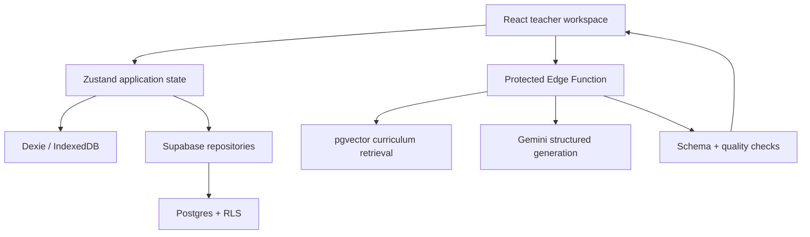

# ChalkBox

> Your classroom. Your plan. Powered by HarshLabs AI.

ChalkBox is a free-first, offline-ready lesson-planning workspace built for **Omni_EdTech_7 — Fast Lesson Planning Support for Teachers** at the Omnikon National Hackathon 2026.

It turns a teacher’s grade, topic, time, language, available materials, class size, and real classroom constraints into a structured plan that can be edited, taught, assessed, reflected on, reused, shared, printed, or exported as PDF.

## Why it is different

- Follows the complete loop: **plan → edit → teach → assess → reflect → reuse**.
- Prioritises blackboard work, common objects, peer learning, and offline alternatives.
- Keeps drafts, teaching sessions, and reflections available in IndexedDB.
- Uses a protected Supabase Edge Function for Gemini; no AI secret reaches the browser.
- Validates AI output against a shared schema, attempts one repair, and runs deterministic quality checks.
- Keeps curriculum source, licence, URL, and attribution metadata with retrieval results.
- Requires no student names or personal information.
- Includes a clearly labelled, fully seeded judge demo that works without accounts, APIs, or network access.

## Try the complete local demo

Requirements: Node.js 22+, pnpm 10.34.5+, and Git.

```bash
git clone https://github.com/harshawardhanchitnis/Omnikon_Hackathon_Harshawardhan_Chitnis.git
cd Omnikon_Hackathon_Harshawardhan_Chitnis
git switch build/chalkbox-complete
corepack enable
pnpm install
pnpm dev
```

Open `http://localhost:5173`, choose **Explore the prepared demo**, and follow the dashboard prompt. No environment file is required for the prepared demo.

## Enable the production-like cloud path

Copy `.env.example` to `.env.local` and set the public browser values:

```dotenv
VITE_SUPABASE_URL=https://your-project.supabase.co
VITE_SUPABASE_PUBLISHABLE_KEY=sb_publishable_replace_me
VITE_APP_URL=http://localhost:5173
VITE_TURNSTILE_SITE_KEY=
```

The Gemini key is **never** placed here. It belongs only in Supabase Edge Function secrets. See [docs/DEPLOYMENT.md](docs/DEPLOYMENT.md).

## Commands

| Command                  | Purpose                                               |
| ------------------------ | ----------------------------------------------------- |
| `pnpm dev`               | Start the Vite development server                     |
| `pnpm build`             | Type-check and create the production PWA in `dist/`   |
| `pnpm preview`           | Preview the production build                          |
| `pnpm typecheck`         | Run strict TypeScript checks                          |
| `pnpm lint`              | Run ESLint and accessibility lint rules               |
| `pnpm test`              | Run unit and component tests                          |
| `pnpm test:e2e`          | Run desktop and mobile Playwright journeys            |
| `pnpm test:a11y`         | Run automated accessibility checks                    |
| `pnpm fixtures:validate` | Validate seeded lesson plans against shared contracts |
| `pnpm screenshots`       | Capture product screenshots from a running preview    |
| `pnpm verify`            | Run the non-browser CI verification chain             |

Install Playwright’s free local browser once before E2E tests:

```bash
pnpm exec playwright install chromium
```

## Repository map

```text
src/                    React application, pages, components, services and offline store
packages/contracts/     Shared TypeScript/Zod domain and AI response contracts
supabase/migrations/    Postgres schema, pgvector, RLS policies and original seed content
supabase/functions/     Protected Gemini generation, indexing and health functions
tests/e2e/              Full lifecycle, mobile and accessibility browser tests
scripts/                Fixture validation and screenshot capture
docs/                   Architecture, deployment, security, testing and demo guide
report/                 Submission-ready technical report and evidence index
public/                 PWA icons, Cloudflare headers and SPA routing rules
```

## Architecture at a glance



The prepared demo remains local and labelled. Registered accounts use the same UI contracts while syncing through RLS-protected tables.

## Documentation

- [Project scope and build contract](docs/PROJECT_SCOPE.md)
- [System architecture](docs/ARCHITECTURE.md)
- [AI and retrieval pipeline](docs/AI_PIPELINE.md)
- [Security and privacy](docs/SECURITY.md)
- [Testing](docs/TESTING.md)
- [Deployment](docs/DEPLOYMENT.md)
- [Five-minute demo guide](docs/DEMO_GUIDE.md)

## Team

**Team HarshLabs** — Harshawardhan Chitnis (solo participant)  
Problem statement: **Omni_EdTech_7**  
Omnikon National Hackathon 2026

## Licence

Source code is available under the [MIT License](LICENSE). Curriculum names are used for alignment metadata. ChalkBox does not reproduce substantial textbook prose; source-specific rights and attribution remain with their publishers.
