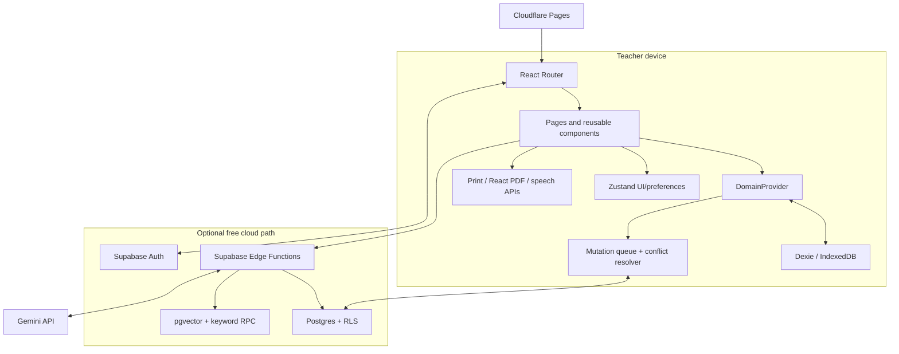
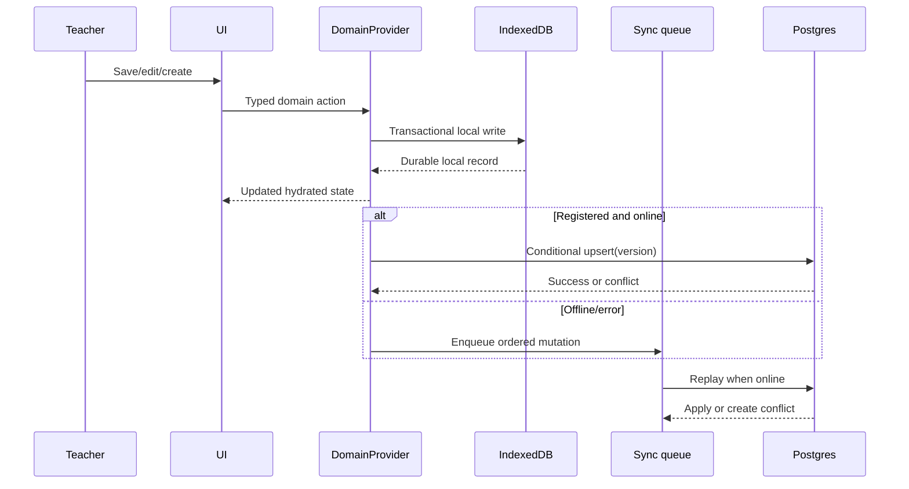
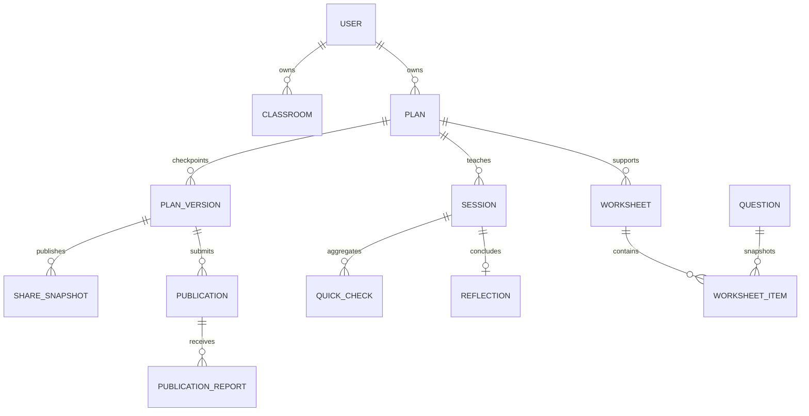
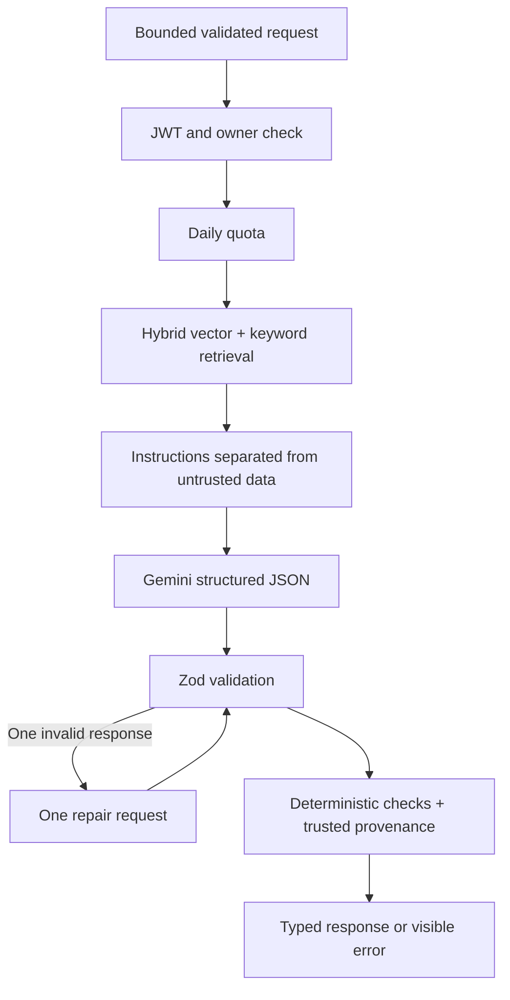

# ChalkBox system architecture

## Principles

1. **Local first, cloud capable.** Classroom-critical records are committed to IndexedDB before optional remote sync.
2. **Domain state is not UI state.** `DomainProvider` hydrates Dexie-backed entities; Zustand stores only identity shell, preferences, mode, sidebar and transient UI controls.
3. **One contract boundary.** Fixtures, forms, repositories, PDFs, Edge Functions and tests share TypeScript/Zod shapes from `@chalkbox/contracts`.
4. **Immutable external views.** Share links and approved community publications contain snapshots of a specific version.
5. **Server-side intelligence.** Gemini keys, quotas, retrieval, prompt assembly, repair and logging stay in Edge Functions.
6. **Visible failure and provenance.** Prepared/rule-based paths are labelled; no failed AI call silently masquerades as AI output.
7. **No student data model.** Assessment and analytics operate on questions, lesson evidence and anonymous aggregate counts.

## Runtime topology

## Application layers

| Layer                | Responsibility                                                            | Location                                |
| -------------------- | ------------------------------------------------------------------------- | --------------------------------------- |
| Delivery             | PWA build, service worker, headers, SPA fallback, CI                      | `vite.config.ts`, `public`, `.github`   |
| Routing/shell        | Lazy routes, guards, layouts, mobile/desktop navigation                   | `src/App.tsx`, `src/components/layout`  |
| Presentation         | Pages, accessible controls, domain components, empty/loading/error states | `src/pages`, `src/components`           |
| UI state             | Mode, profile shell, preferences, navigation state                        | `src/store/app-store.ts`                |
| Domain orchestration | Hydration, actions, derived collections, local/remote coordination        | `src/state/domain-context.tsx`          |
| Persistence/sync     | Dexie tables, repositories, queue replay, conflicts                       | `src/lib/offline-db.ts`, `src/services` |
| Contracts            | Entities, enums, schemas and bounded generation inputs                    | `packages/contracts/src`                |
| Intelligence         | Auth, quotas, structured AI, RAG, repair, quality                         | `supabase/functions`                    |
| Database/security    | Tables, versions, indexes, RPCs, RLS, grants and triggers                 | `supabase/migrations`                   |

## State and write flow

Updates carry a record version. A remote mismatch becomes a conflict record with local and cloud snapshots. The teacher explicitly keeps local, keeps cloud, or duplicates both. Queue order is stable and failures remain visible.

## Entity relationships

## Demo fixture handling

Canonical fixtures live in `src/data/demo-fixtures.ts`. On first demo entry they are structured-cloned into Dexie so runtime edits never mutate constants. `seedDemoDomainData(true)` clears only ChalkBox tables and restores the exact seeded records. Demo mode never writes those records to Supabase and every prepared/seeded AI-like artifact carries an explicit label.

## AI and retrieval flow

The generic `ai-action` function supports Quick Brief parsing, section adjustment, assessment generation and translation/adaptation. Lesson generation has a dedicated route. Assessment results return as unreviewed variants and require acceptance before entering the bank.

## Sharing, publication and report flow

- **Share:** checkpoint plan → create immutable snapshot/token → optionally set expiry → public reader validates expiry/revocation → render read-only snapshot.
- **Community:** teacher submits a specific plan-version snapshot → admin approves/rejects with reason → only approved immutable snapshot appears in discovery → adaptation creates a private child plan with attribution.
- **PDF:** client renders the same typed snapshot through React PDF → mixed-script text selects bundled Latin/Devanagari fonts → source/disclosure retained → download stays on device.
- **Worksheet:** worksheet items store question snapshots, so later question edits do not alter an already composed resource or answer key.

## Production-like versus prepared behavior

| Capability           | Production-like path                 | Prepared demo path                            |
| -------------------- | ------------------------------------ | --------------------------------------------- |
| Identity             | Supabase passwordless user           | Fictional local teacher                       |
| Domain persistence   | IndexedDB + owner-scoped Postgres    | IndexedDB only                                |
| AI generation        | Authenticated Edge Function → Gemini | Explicit labelled prepared/rule-based content |
| Curriculum retrieval | Approved hybrid RPC                  | Original static curriculum metadata           |
| Sharing              | Postgres snapshot/token              | Same-browser immutable snapshot demonstration |
| Community            | Server moderation and approved rows  | Seeded immutable approved/pending snapshots   |
| Analytics            | Derived from owned records           | Derived from fixture records                  |
| Admin                | Role checked by RLS/function         | Clearly labelled demo-admin mode              |

## Deployment

Cloudflare Pages serves immutable Vite assets and the generated service worker. `_redirects` maps SPA paths to `index.html`; `_headers` applies browser security controls. Supabase independently hosts Auth, Postgres, pgvector and Edge Functions. The browser contains only public Supabase/Turnstile/application values. Gemini is reachable only from the Edge Function runtime.
