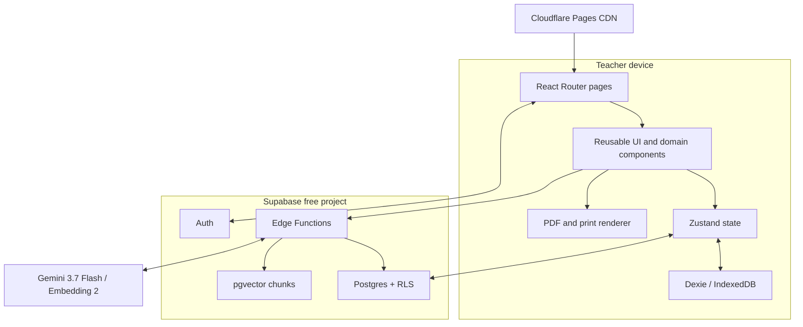
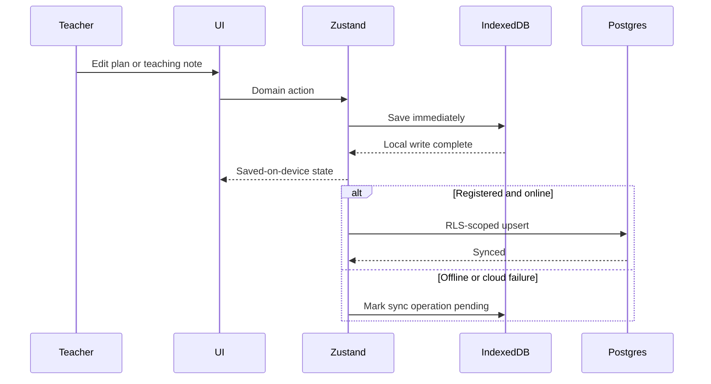
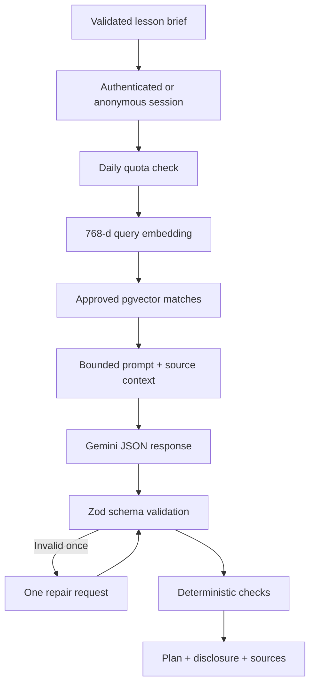

# ChalkBox system architecture

## Architectural principles

1. **Local first, cloud capable.** The app writes classroom-critical records to IndexedDB before optional cloud synchronisation.
2. **One domain contract.** Browser fixtures, editor state, PDF export, Edge Function output, and tests share TypeScript/Zod shapes.
3. **Server-side intelligence.** Gemini credentials, retrieval, quotas, prompt construction, schema repair, and operational logging live in Supabase Edge Functions.
4. **Fail visibly.** Production AI errors never turn into disguised prepared content.
5. **Teacher ownership.** RLS scopes private records to `auth.uid()`; public access is a deliberate per-plan flag and slug.
6. **No student data model.** Analytics derive from teacher-level plans and group-level reflection signals.

## Runtime topology

## Application layers

| Layer             | Responsibilities                                                   | Key locations                           |
| ----------------- | ------------------------------------------------------------------ | --------------------------------------- |
| Presentation      | Pages, layout, components, responsive states, accessibility        | `src/pages`, `src/components`           |
| Application       | Route guards, Zustand actions, derived analytics, lesson quality   | `src/App.tsx`, `src/store`, `src/lib`   |
| Domain            | Lesson, session, reflection, profile, support, analytics contracts | `packages/contracts/src`                |
| Persistence       | IndexedDB, Postgres mapping, sync queue markers                    | `src/lib/offline-db.ts`, `src/services` |
| Intelligence      | Auth, quota, embedding, RAG, generation, repair, scoring           | `supabase/functions`                    |
| Database/security | Tables, indexes, pgvector RPC, RLS, grants, triggers               | `supabase/migrations`                   |
| Delivery          | Vite PWA, Cloudflare routing/headers, CI                           | `vite.config.ts`, `public`, `.github`   |

## State and persistence flow

Local fixtures are copied before use; demo mutations never modify the canonical fixture constants. `resetDemo()` clears the ChalkBox IndexedDB tables and restores the canonical set.

## AI request flow

The Edge Function logs request ID, user ID, model, status, latency, retrieval count, and quality score. It does not log the full prompt or plan.

## Production-like versus simulated behaviour

| Capability    | Production-like path             | Prepared demo path                       |
| ------------- | -------------------------------- | ---------------------------------------- |
| Identity      | Supabase email auth              | Fictional local teacher                  |
| AI            | Edge Function → Gemini           | Curated water-cycle plan, labelled       |
| Persistence   | IndexedDB + RLS Postgres         | IndexedDB/localStorage only              |
| Sharing       | Public slug loaded from Postgres | Same-browser fixture/share demonstration |
| Analytics     | Derived from teacher records     | Derived from seeded records              |
| Mentors/admin | Schema and role gates ready      | Seeded UI interactions and metrics       |

## Deployment

Cloudflare Pages serves the immutable Vite assets and applies `_headers` and `_redirects`. Supabase independently hosts Auth, Postgres, pgvector, and Edge Functions. Gemini is reachable only from the Edge Function runtime. The browser holds only the Supabase URL, publishable key, optional Turnstile site key, and public app URL.
